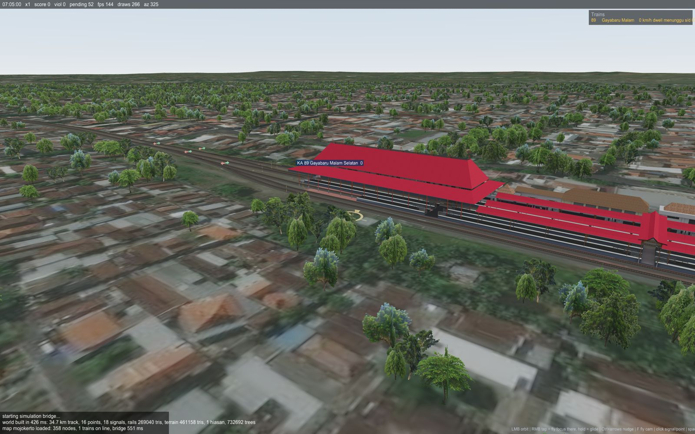
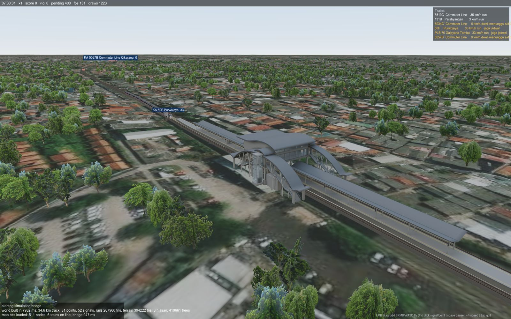
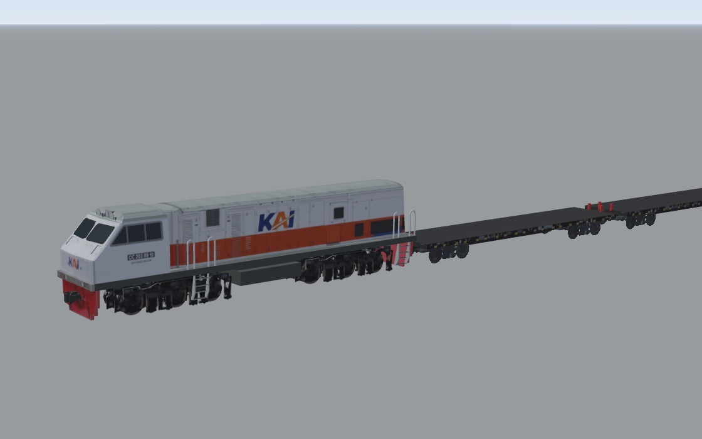
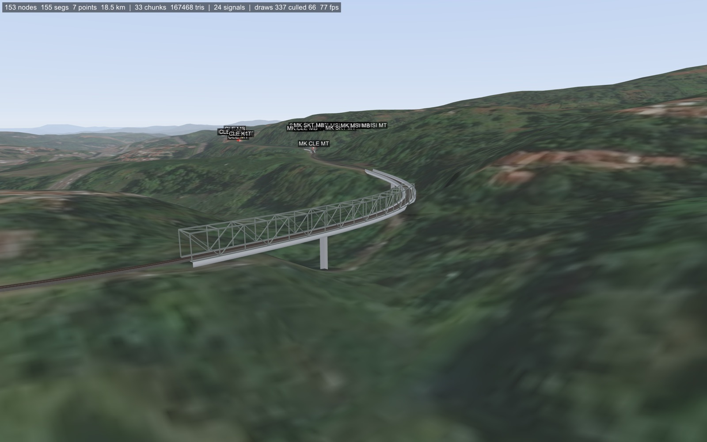
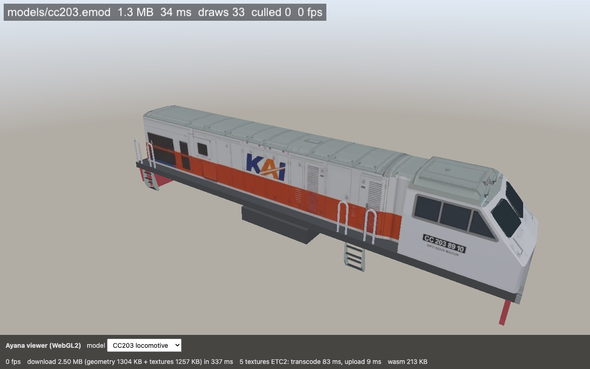

# Ayana Engine — a from-scratch 3D engine for the 168Railway PPKA Simulator

<p align="center">
  
  
</p>
<p align="center">
  <em>Mojokerto station</em> &nbsp;&nbsp;&nbsp;&nbsp; <em>Bekasi with the AI dispatcher</em>
</p>
<p align="center">
  
  
</p>
<p align="center">
  <em>CC 203 on KA 306 Parcel Selatan</em> &nbsp;&nbsp;&nbsp;&nbsp; <em>Warren truss over the Cilame valley</em>
</p>

<p align="center">
  
  
  
  
  
  
</p>
<p align="center"><sub>Lines of code by language, third-party code excluded (<code>tools/third_party</code>, <code>web/vendor</code>). C++20 with no engine dependencies; the TypeScript is the simulation bridge, the JavaScript/HTML the web viewer page.</sub></p>

Ayana is a small C++20 game engine written from zero for the **PPKA Simulator** (a train-dispatcher
game): no Unity, no Godot, no three.js. It renders the simulator's real maps, rolling stock and
interlocking in 3D, and it is designed to run everywhere the game needs to live — macOS today,
Android (Flutter `Texture`) and the web (WebAssembly) next.

The **simulation is not rewritten**: the original TypeScript engine in `ppka-wannabe-2` runs as a
child process and the engine talks to it over a tiny JSON-lines protocol (`bridge/PROTOCOL.md`).
That protocol mirrors the planned C API of the C++ simulation port, so the Node bridge can be
swapped for a native library later without touching the renderer.

## What works

| Area | Status |
|---|---|
| Math, JSON parser, GLB parser, own binary model format (`.emod`) | own code, no dependencies |
| Renderer | OpenGL 4.1 / GLES 3 behind a thin RHI, metallic-roughness PBR, `KHR_materials_unlit`, alpha mask/blend, fog, frustum culling, instancing |
| Terrain | Terrarium DEM (z13/z10) + satellite imagery (z14 → z17 near stations), rail corridor carving (embankments/cuttings), per-texture ground patches |
| Track | cubic-Bézier segments from the map save, arc-length LUT, 1-D vertical profile, ballast + rails (gauge 1.068 m), bridges, tunnels |
| Signals & points | colour-light and semaphore signals with live aspects, point arrows with set/locked colours, screen-space picking, hover tooltips, route ribbons |
| Trains | consists from the timetable, body/bogie/coupling GLBs with the simulator's normalisation rules, box fallback |
| Scenery | station buildings from the save's `hiasan`, instanced trees from the satellite green mask |
| Sky & light | gradient sky and light ladder driven by the simulated clock |
| Camera | orbit, free-fly, Trainz-style compass (right-click focus, glide, Ctrl+arrows) |
| HUD | clock, score, time scale, train list, projected train labels, message log |


## Build (macOS)

```bash
brew install cmake ninja glfw
cmake --preset mac-release && cmake --build --preset mac-release   # or mac-debug (ASan + UBSan)
```

The reference project must sit next to this repo: `../ppka-wannabe-2` (maps in `src/data/*.json`,
models in `public/model3d/`). Node ≥ 20 is needed for the simulation bridge (`npx tsx`).

## Play

```bash
./build/mac-release/fetch_tiles mojokerto            # once per map: DEM + imagery -> assets/terrain/
./build/mac-release/ppka mojokerto 07:00 --no-ai     # map, start clock; drop --no-ai to watch the AI
```

| Input | Action |
|---|---|
| left drag / scroll | orbit / zoom |
| right-click tap | fly the camera focus (compass) to that ground point |
| right-click hold | glide; speed grows with cursor distance from the screen centre |
| Ctrl + arrows / arrows | nudge focus / rotate & tilt |
| F, then WASD + QE, Shift | free-fly camera |
| click a signal | set a route (expert mode) or cancel it; the tooltip explains rejections |
| click a point arrow | flip the point |
| space, +, − | pause, faster, slower |

Maps known to work: `mojokerto` (one station, 64 trains), `bks` (Bekasi, 3 stations, 503 trains).

## Web (WebAssembly)



```bash
brew install emscripten
cmake --preset wasm && cmake --build --preset wasm      # -> build/wasm/viewer.js/.wasm (213 KB) + font
web/build-models.sh                                     # geometry .emod (~1 MB) + KTX2 GLBs + page JS -> build/wasm
npx serve -l 8766 build/wasm                            # open http://127.0.0.1:8766/index.html
```
The same RHI runs on WebGL2 (`ENG_GL_ES`); only the window hints and the main loop differ. Nothing but the
font is preloaded: geometry is streamed with `emscripten_fetch` (`engine/core/fetch.h`) when the page calls the
exported `viewer_load(url)`. The simulator bridge is native-only, so the web build currently ships the model viewer.

### Ayana: the engine inside the reference web client

`engine/api/engine_api.h` is a C ABI (`eng_*`, `extern "C"`) that turns the whole world renderer into a library
for a host that owns the simulation and the UI. The `ayana` CMake target (Emscripten only) builds it as an ES module:

```bash
cmake --preset wasm && cmake --build --preset wasm --target ayana   # build/wasm/ayana.js/.wasm/.data (font)
build/mac-release/fetch_tiles mojokerto                             # per-tile terrain (assets/terrain/<map>/ + index.json; the web only uses the index)
web/build-models.sh --all mojokerto bks                             # geometry-only .emod per catalog slot the maps need
web/deploy-to-ppka.sh mojokerto bks                                 # -> ../ppka-wannabe-2/public/ayana + src/tiga-ayana/simState.ts
```
In ppka-wannabe-2 the adapter `src/tiga-ayana/duniaAyana.ts` implements the `Dunia3D` surface `main.ts` uses;
`?renderer=ayana` (or `localStorage pk-3d-renderer = ayana`) switches the 3D view to it. The host feeds the save
(`World.toJSON()`), the bridge summary and, every frame, the same object the bridge's `step` returns
(`bridge/sim-state.ts`, shared by the Node bridge and the browser), and answers the engine's asset requests
(`Module.onAssetRequest(kind, path)`): terrain tiles, the baked city, `.emod` geometry and KTX2 textures through
`eng_texture_*`. Clicks come back as `signal:<id>` / `point:<id>` and go through the client's own `klikSinyal` /
`klikWesel`. Everything the native app draws (`engine/app/world_scene.*`) is shared. Models and terrain tiles
are served from `public/ayana/` in dev (gitignored there) and belong on R2 in production. Mojokerto in headless
Chromium: 63 MB download (48 MB terrain, 8 MB geometry, 5 MB KTX2), world built ~1 s after the data arrived, 60 fps.

### Web textures: KTX2 transcoded in the browser

Raw ETC2 blocks are ~10x larger than the Basis Universal KTX2 (ETC1S + zstd) files the reference client already
downloads, so the web page does not use EMOD-embedded textures at all:

- `convert --target web --textures external` writes a **geometry-only EMOD v6**: every image is a placeholder
  (size / wrap / colour-space hints + `source`, its index in the KTX2 twin); the loader shows 1x1 white until the
  texture arrives. CC203: 1.3 MB instead of 16.6 MB.
- `web/ktx2.js` (plain ES module) fetches the reference project's KTX2 GLB (`public/model3d/ktx2/<berkas>`, copied
  to `build/wasm/models/ktx2/`), pulls the KTX2 blobs out of the GLB container and transcodes **all mip levels** in a
  Web Worker (`web/ktx2-worker.js`) with the BinomialLLC transcoder that three.js ships (`web/vendor/basis_transcoder.*`,
  Apache 2.0 — third-party code stays on the JS side, the engine has no decoders). Target format by
  `viewer_supports()`: ETC2 → BC1/BC3 → RGBA8.
- The blocks go into the engine through the viewer's C ABI (`viewer_texture_begin(image, w, h, format, mips, srgb,
  wrapS, wrapT)`, `viewer_texture_mip(level, ptr, bytes)`, `viewer_texture_end()`, buffers from `viewer_alloc`),
  which calls `rhi::createTextureCompressed` and swaps the texture into the loaded `GpuModel`.

CC203 in headless Chromium: **2.50 MB download** (1304 KB geometry + 1257 KB textures, five 4096² atlases),
transcode 83 ms, upload 9 ms; the page's bottom bar shows the split, the format and the timings. Native builds are
unchanged (`convert --target desktop` keeps embedding BC1/BC3).

### Textures (EMOD v5)

`convert --target web|desktop|android` stores every texture GPU-ready with its full mip chain: **ETC2**
(RGB / RGBA+EAC) for web and Android, **BC1/BC3** for desktop (macOS GL exposes S3TC only). Sources: the
Basis Universal KTX2 twins the reference project ships (`public/model3d/ktx2/<berkas>`, found automatically,
transcoded with the BinomialLLC transcoder in `tools/third_party/basisu`), otherwise the GLB's PNG encoded by
`tools/texcomp` (own ETC1/EAC encoder, stb_dxt). `--fallback PX` adds an RGBA8 copy per texture for GPUs without
the format (`--fallback 0` drops it). The runtime uploads the first variant `rhi::supports()` and never decodes
anything. CC203 went from 22.3 MB (raw RGBA) to 4.8 MB desktop. `fetch_tiles` also writes per-tile files
(`assets/terrain/<map>/{dem,sat/<layer>}/<z>_<x>_<y>.bin` + `index.json`) that the native app streams by camera
distance (`Terrain::update`, spec `ubinStream.ts` radii); the web client only takes the index and fetches
DEM/satellite tiles straight from the tile servers, decoded by the browser (`src/tiga-ayana/ubinAyana.ts`).

## Tests

```bash
cmake --preset mac-debug && cmake --build --preset mac-debug
ctest --preset mac-debug        # 7 tests, ~5 s: math, JSON, GLB/EMOD, track LUT vs TS, compass, profile, sim bridge
ctest --preset mac-debug-gpu    # golden image (opens a window; compares tests/golden/coupling.ppm)
```

Tests live in `tests/` (one executable each, `tests/check.h` is the whole framework). `test_track`
compares the C++ track geometry with a dump of the TypeScript engine (`tests/ref/mojokerto_track.json`;
regenerate with `cd ../ppka-wannabe-2 && npx tsx ../game-engine-experiment/tests/ref/track_ref.ts`).
`test_bridge` skips when `npx` is missing. After an intentional rendering change run
`./build/mac-debug/test_golden --update` and commit the new `tests/golden/coupling.ppm`.

## Layout

```
engine/   math · rhi (GPU layer) · core (window, cameras, JSON) · asset (GLB, EMOD)
          render (PBR, sky, text) · sim (bridge client) · world (track, rails, terrain,
          signals, points, routes, rolling stock, trains, vegetation)
bridge/   sim-bridge.ts — JSON-lines front end for the TypeScript simulation
examples/ ppka (the game) · viewer · railtest · terraintest · traintest · tracktest · simtest · cube
tools/    offline converters (the only place third-party decoders are allowed):
          convert (GLB → .emod, KTX2 transcoding) · fetch_tiles (DEM/imagery → .dem/.sat + per-tile files)
          fontgen (TTF → .efnt) · texcomp (ETC1/EAC + BC encoders shared by the converters)
web/      index.html demo page, build-models.sh, deploy-to-ppka.sh (Ayana renderer into ppka-wannabe-2)
docs/     world-spec.md (how the reference three.js scene is built, with exact constants)
```

## Roadmap / what is still missing

See **[docs/PARITY.md](docs/PARITY.md)** — the feature-by-feature checklist against the reference
three.js client, plus the working rules for contributors.

## Principles

* Everything the runtime executes is our code; third-party code (stb) lives only in offline tools.
* World coordinates stay `double` (Web Mercator, ~1.2e7 m); the scene is `float` around a local origin.
* Game rules live in one place — the simulator. The engine draws state and sends clicks.
* Every example can render headless (`ENG_CAPTURE=/tmp/x.ppm`) for screenshot-based verification.
